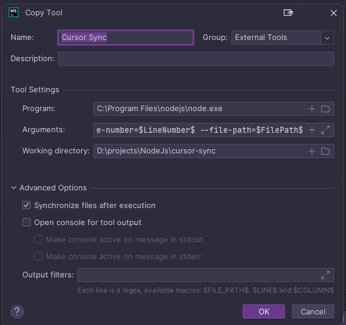

# Cursor Sync

## Table of Contents

- [Installation](#installation)
- [Usage](#usage)
- [Contributing](#contributing)
- [License](#license)
- [IDE Configuration](#ide-configuration)

## Installation

1. Ensure you have `bun` installed on your system. If not, install it from [https://bun.sh](https://bun.sh).

2. Clone the repository:
   ```
   git clone https://github.com/your-username/cursor-sync.git
   cd cursor-sync
   ```

3. Install dependencies:
   ```
   bun install
   ```

4. Install the "REST Control" extension for Visual Studio Code:
   - Open Visual Studio Code
   - Go to the Extensions view (Ctrl+Shift+X or Cmd+Shift+X)
   - Search for "REST Control"
   - Click "Install" on the extension by dpar39
   - Alternatively, you can install it directly from the [Visual Studio Code Marketplace](https://marketplace.visualstudio.com/items?itemName=dpar39.vscode-rest-control)

5. Build the project:
   ```
   bun run build
   ```

## Usage, IDE Configuration

### JetBrains IDE External Tool Configuration

To set up the Cursor Sync tool in your JetBrains IDE (e.g., WebStorm, IntelliJ IDEA), follow these steps:

1. Go to File > Settings (on Windows/Linux) or IDE Name > Preferences (on macOS).
2. Navigate to Tools > External Tools.
3. Click the '+' button to add a new external tool.
4. Configure the tool with the following settings:
   - Name: Cursor Sync
   - Group: External Tools
   - Program: `C:\Program Files\nodejs\node.exe` (adjust path if necessary)
   - Arguments: `./build/index.js --root=$ContentRoot$ --column-number=$ColumnNumber$ --line-number=$LineNumber$ --file-path=$FilePath$ --select=$SelectionStartLine$:$SelectionStartColumn$-$SelectionEndLine$:$SelectionEndColumn$`
   - Working directory: `D:\projects\NodeJs\cursor-sync` (adjust to your project path)
5. In the Advanced Options section:
   - Check "Synchronize files after execution"
   - Uncheck "Open console for tool output"
6. Click OK to save the configuration.

Now you can use the Cursor Sync tool from the Tools > External Tools menu in your IDE.

### Visual Studio Code Configuration

Before running the Cursor Sync tool in Visual Studio Code, make sure you have installed the "REST Control" extension as described in the Installation section. This extension is required for proper functionality of the tool.
